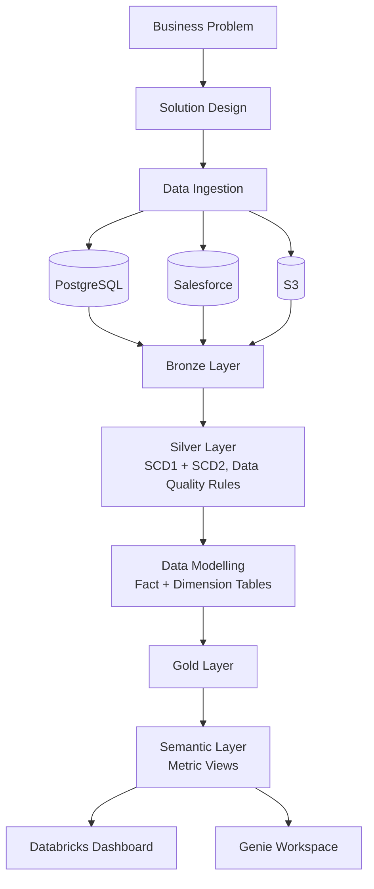

# Retail_Q_ETL_Project

An end-to-end retail data platform built on Databricks — from raw source data
to business dashboards and natural-language querying via Genie.

## Architecture



## How It Works

### 1. Data Sources
- **PostgreSQL** — operational database holding orders, customers, and transactional retail data.
- **Salesforce** — CRM data: leads, opportunities, and customer relationship records.
- **S3** — raw files (CSV/JSON) such as product catalog dumps or clickstream logs.

### 2. Ingestion Layer
- PostgreSQL data is captured via CDC/JDBC so inserts and updates are tracked as they happen.
- Salesforce data is pulled via its REST/Bulk API on a scheduled basis.
- S3 files are picked up incrementally using Databricks Auto Loader, so only new files are processed each run.

### 3. Bronze Layer
Raw data lands here exactly as received from each source — append-only, no transformations, kept for traceability and reprocessing if needed.

### 4. Silver Layer
Bronze data is cleaned, validated, and conformed into a consistent schema.
- **SCD1** is applied to fields where only the latest value matters (e.g., correcting a customer's phone number).
- **SCD2** is applied where historical tracking matters (e.g., product price changes over time), keeping effective-date ranges.
- Data quality rules (`expect` / `expect_or_drop`) reject or flag bad records on key fields.

### 5. Data Modelling
Cleaned Silver data is shaped into a star schema — fact tables (e.g., sales transactions) linked to dimension tables (e.g., product, customer, date) — to support efficient querying.

### 6. Gold Layer
Modeled data is aggregated into business-ready tables — daily sales summaries, customer lifetime value, category-level performance, etc.

### 7. Semantic Layer
Gold tables are exposed through Unity Catalog metric views, so a metric like "total revenue" or "active customers" is defined once and reused consistently everywhere downstream.

### 8. Consumption
- **Databricks Dashboard** — visualizes key metrics from the semantic layer for stakeholders.
- **Genie Workspace** — lets users ask natural-language questions (e.g. "What were the top-selling categories last month?") and get answers grounded in the same semantic layer.

### Cross-Cutting
- **Orchestration** — Databricks Workflows schedules and monitors every stage from ingestion through Gold.
- **Governance** — Unity Catalog manages access control and lineage across all layers, so any Gold-layer number can be traced back to its raw source.

## Tech Stack
- Databricks (Lakeflow Declarative Pipelines / DLT)
- PySpark
- Unity Catalog: `retail_q`
- Delta Lake
- Databricks Workflows (orchestration)
- Databricks Dashboards & Genie Workspace

## Data Quality Rules (Silver Layer)
Enforced using `expect` / `expect_or_drop` on:
- product_id
- product_name
- category
- price
- launch_date
- supplier_name

## Folder Structure
```
Retail_Q_ETL_Project/
├── notebooks/        # Bronze, Silver, Gold pipeline notebooks
├── docs/             # Diagrams, notes (optional)
└── README.md
```

## How to Run
1. Open the pipeline in the Databricks Workflows / Lakeflow Pipelines UI.
2. Point it at catalog `retail_q`.
3. Run the pipeline and check the event log for expectation pass/fail metrics.

## Author
Pawan — AWS Data Engineer