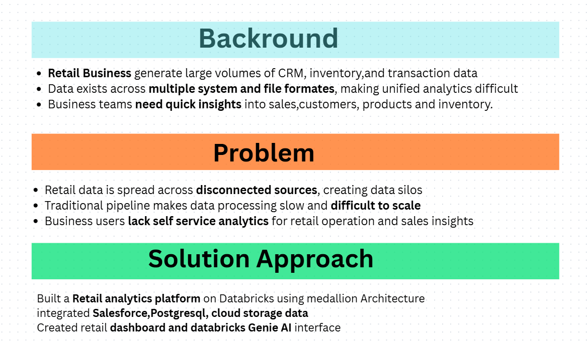
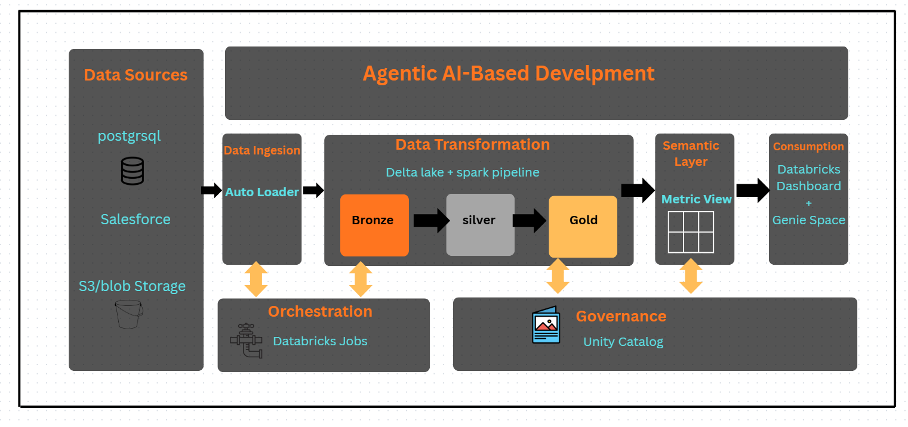
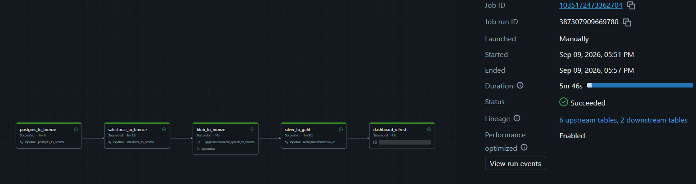
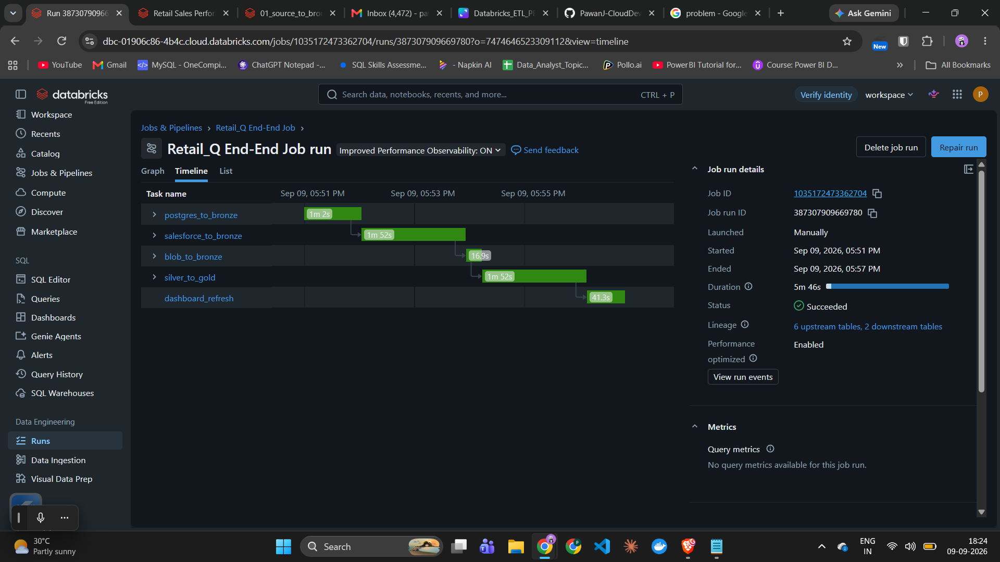
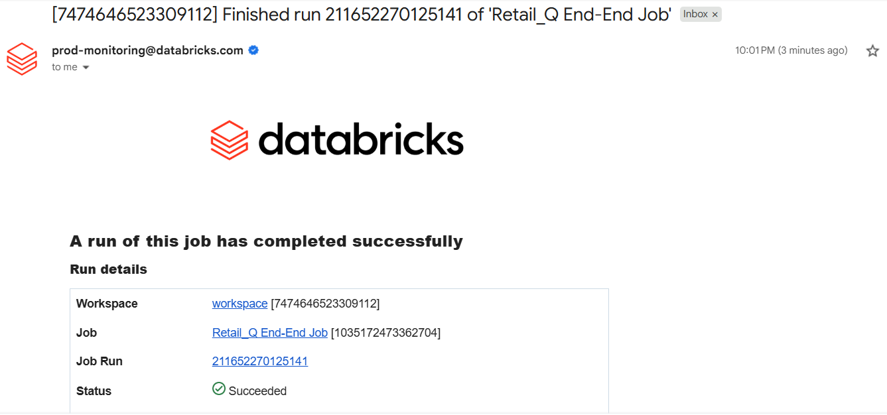

# Retail_Q_ETL_Project

An end-to-end retail data platform built on Databricks — from source data ingestion to business-ready dashboards and natural-language querying through Genie.

## Architecture


## How It Works

### 1. Data Sources

The project integrates data from three source systems:

| Source         | Tables / Data     | SCD Strategy            |
| -------------- | ----------------- | ----------------------- |
| **PostgreSQL** | `product_catalog` | **SCD Type 2**          |
| **PostgreSQL** | `inventory`       | **SCD Type 1**          |
| **Salesforce** | `account`         | **SCD Type 2**          |
| **Salesforce** | `opportunity`     | Standard transformation |
| **Amazon S3**  | `transactions`    | Standard transformation |

### 2. Ingestion Layer

* **PostgreSQL** — `product_catalog` and `inventory` data are ingested into the Databricks Bronze layer through the configured PostgreSQL ingestion pipeline.
* **Salesforce** — `account` and `opportunity` data are ingested into the Salesforce Bronze layer through the configured Salesforce ingestion process.
* **Amazon S3** — `transactions` data is ingested into the Bronze layer through the configured S3 ingestion process.

### 3. Bronze Layer

The Bronze layer stores source data with minimal transformation.

It provides:

* Raw/source-level data retention
* Traceability
* Reprocessing capability
* Source-specific Bronze tables

The Bronze layer contains:

* PostgreSQL: `product_catalog`, `inventory`
* Salesforce: `account`, `opportunity`
* S3: `transactions`

### 4. Silver Layer

The Silver layer cleans, validates, standardizes, and transforms Bronze data into a consistent structure.

Key activities include:

* Data cleansing and standardization
* Null and data quality validation
* Business transformations
* SCD Type 1 and SCD Type 2 implementation
* Schema normalization

#### Slowly Changing Dimensions

Different SCD strategies are applied based on business requirements:

| Table             | SCD Type       | Purpose                                                                        |
| ----------------- | -------------- | ------------------------------------------------------------------------------ |
| `product_catalog` | **SCD Type 2** | Maintains historical changes to product attributes                             |
| `account`         | **SCD Type 2** | Maintains historical changes to customer/account attributes                    |
| `inventory`       | **SCD Type 1** | Keeps the latest inventory information without maintaining historical versions |

**SCD Type 1** updates the existing record with the latest value. Historical values are not retained.

**SCD Type 2** preserves historical versions of records by creating new versions when tracked attributes change.

Data quality rules are implemented using Databricks expectations such as `expect` and `expect_or_drop`.

### 5. Data Modelling

Clean Silver data is transformed into a dimensional model consisting of:

* Fact tables
* Dimension tables
* Business relationships

The model follows a star-schema approach to support analytical queries and reporting.

### 6. Gold Layer

The Gold layer contains business-ready, analytics-oriented data.

Examples include:

* Sales metrics
* Revenue analysis
* Customer performance
* Product performance
* Category-level analysis

### 7. Semantic Layer

Gold data is exposed through the semantic/metric layer.

Business metrics such as revenue, sales, and customer metrics can be defined consistently and reused by downstream consumers.

### 8. Consumption

* **Databricks Dashboard** — provides visual business insights and key performance metrics.
* **Genie Workspace** — enables users to ask business questions using natural language and retrieve answers from the curated data.

### Cross-Cutting Capabilities

* **Orchestration** — Databricks Pipelines/Workflows are used to execute and monitor the ETL process.
* **Governance** — Unity Catalog provides centralized data access control, organization, and lineage.
* **Delta Lake** — provides reliable storage with ACID transactions, schema management, and scalable data processing.

## Project Documentation

The following screenshots provide a high-level view of the project requirements, architecture, pipeline execution, execution timing, and successful completion.

### 1. Business Requirements

Project requirements and business objectives.



### 2. Project Architecture

End-to-end architecture showing the flow from source systems through the Medallion Architecture to the consumption layer.



### 3. Pipeline Execution

Databricks pipeline running and processing the ETL workflow.



### 4. Pipeline Execution Time

Pipeline execution details showing the processing time and run information.



### 5. Successful Pipeline Execution

Successful pipeline completion notification confirming that the ETL workflow completed successfully.



## Tech Stack

* Databricks
* Lakeflow Declarative Pipelines
* PySpark
* Delta Lake
* Unity Catalog
* Databricks Workflows
* Databricks Dashboards
* Genie Workspace
* PostgreSQL
* Salesforce
* Amazon S3

## Data Quality Rules

Data quality checks are implemented primarily in the Silver layer using Databricks expectations such as:

```python
@dp.expect(...)
@dp.expect_or_drop(...)
```

Typical validation areas include:

* `product_id`
* `product_name`
* `category`
* `price`
* `launch_date`
* `supplier_name`

These rules help prevent invalid records from propagating into downstream analytical tables.

## Folder Structure

```text
Retail_Q_ETL_Project/
│
├── notebooks/
│   ├── bronze/
│   ├── silver/
│   └── gold/
│
├── docs/
│   ├── 01_business_requirements.png
│   ├── 02_project_architecture.png
│   ├── 03_pipeline_running.png
│   ├── 04_pipeline_running_time.png
│   └── 05_pipeline_success_email.png
│
└── README.md
```

## How to Run

1. Open the required pipeline in the Databricks Pipelines/Workflows UI.
2. Verify the configured catalog and pipeline settings.
3. Run the pipeline.
4. Monitor the pipeline execution and event logs.
5. Validate data quality results and target tables.
6. Verify the Gold/semantic layer data through the dashboard or Genie Workspace.

## Author

**Pawan Jaiswal**
AWS Data Engineer
