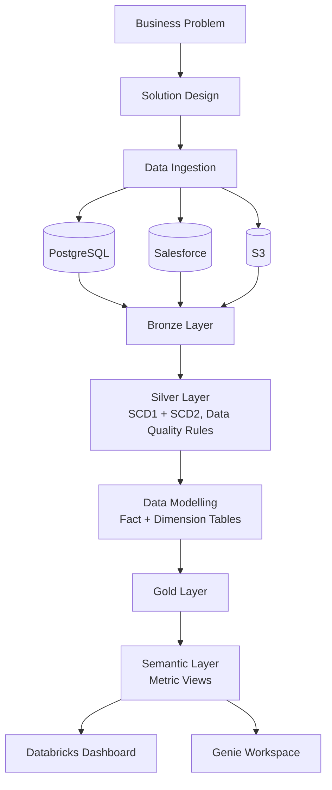

# Architecture

```mermaid
flowchart TD
    A[Business Problem] --> B[Solution Design]
    B --> C[Data Ingestion]
    C --> C1[(PostgreSQL)]
    C --> C2[(Salesforce)]
    C --> C3[(S3)]
    C1 --> D[Bronze Layer]
    C2 --> D
    C3 --> D
    D --> E[Silver Layer<br/>SCD1 + SCD2, Data Quality Rules]
    E --> F[Data Modelling<br/>Fact + Dimension Tables]
    F --> G[Gold Layer]
    G --> H[Semantic Layer<br/>Metric Views]
    H --> I[Databricks Dashboard]
    H --> J[Genie Workspace]
```

